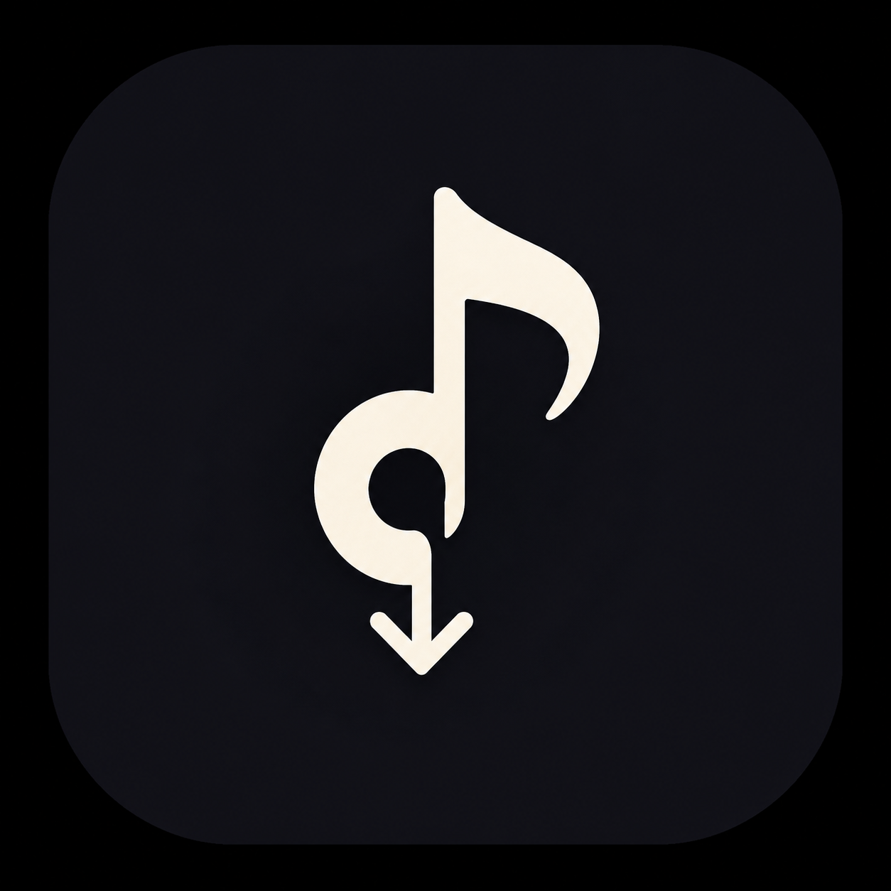

# MusicGrab

A self-hosted music downloader, library manager, and player for YouTube and Spotify — usable
either as a CLI tool or as a local web app with a persistent player bar.

```
musicgrab-web
# open http://127.0.0.1:8765
```

---

## Report: what this project is, what was found, and what changed

This section documents the state the project was in, the assessment that drove the rebuild, and
what was actually built — as a record of the work, not just usage docs.

### Starting point

The project began as a well-structured **Python CLI tool** (`musicgrab`) with no user interface
beyond the terminal. The existing code already covered the hard parts correctly:

- `musicgrab/sources/youtube.py` — video/playlist metadata + audio extraction via `yt-dlp`
- `musicgrab/sources/spotify.py` — Spotify Web API metadata (Spotify does not allow direct audio
  downloads, so tracks are metadata-matched and the audio itself is pulled from YouTube)
- `musicgrab/metadata/embedder.py` — ID3/Vorbis/MP4 tag embedding
- `musicgrab/artwork/saver.py` — album art fetch/embed/save
- `musicgrab/library/manager.py` — local library scan, search, stats, artist/album organization
- `musicgrab/queue/download_queue.py` — an in-memory download queue with status tracking
- `musicgrab/cli.py` — a Click-based CLI (`musicgrab <url>`, `search`, `library`, `queue`, `config`)

In other words: a solid backend with zero front end. Every interaction required a terminal, there
was no way to browse or play what had been downloaded without leaving the tool, and nothing was
usable by anyone who isn't comfortable with a CLI.

### Why a web app

The ask was for something that functions as an actual **music application** — download, browse,
and *play* music in one place — not a set of CLI subcommands and not a static informational
website. A local web app was the right shape for that:

- No new install story for end users beyond `pip install -e .` — it's still one Python
  environment, one process, no separate frontend build/deploy pipeline.
- A browser tab gives a persistent, app-like session (sidebar navigation + an always-present
  player bar) that a CLI fundamentally cannot.
- It reuses **all** of the existing backend logic unchanged — sources, metadata, artwork, and
  library management are called directly, not reimplemented.

### What was built

**Backend — `musicgrab/webapp.py` (FastAPI):**

- `POST /api/downloads` — kicks off a download (track, playlist, or album; YouTube or Spotify) as
  a background thread and returns a job id immediately
- `GET /api/downloads` / `GET /api/downloads/{id}` — poll job status/progress (`queued` →
  `running` → `completed`/`failed`), driven by the existing `youtube_source` / `spotify_source` /
  `metadata_embedder` / `artwork_saver` / `library_manager` objects
- `GET /api/search` — YouTube (and Spotify, if credentials are configured) search
- `GET /api/library`, `POST /api/library/scan`, `GET /api/library/stats` — thin wrappers over
  `LibraryManager`
- `GET /api/stream/{track_id}` — streams a downloaded audio file straight off disk for the
  `<audio>` element
- `GET /api/artwork/{track_id}` — serves saved album art for a track
- `GET /api/config` / `POST /api/config` — read/update the same config the CLI uses
  (`~/.config/musicgrab/config.json`)

Track identity in the API is a stable hash of `source + source_id + title + artist`, computed on
the fly — no schema/migration was needed on top of the existing `library.json`.

**Frontend — `musicgrab/web/` (vanilla HTML/CSS/JS, no build step):**

- App-shell layout: sidebar (Home / Search / Library / Downloads / Settings) + main content +
  a persistent bottom player bar, rather than separate pages
- Paste-a-link box that starts a download job and polls it to completion, with a live progress
  bar and status badge
- Search view with inline "Download" action per result
- Library view backed by the real scanned/downloaded track list, with per-track play buttons
- A working player: play/pause, next/prev within the current list, seek, volume, and a
  currently-playing highlight — backed by a plain `<audio>` element and the streaming endpoints
  above
- Settings view for audio format/quality, metadata/artwork toggles, and Spotify credentials
- Dark, high-contrast visual design (indigo → blue gradient accent, Inter/Manrope type,
  inline SVG icon set — no emoji used as UI iconography), responsive down to mobile widths

### What was verified

Before considering this done, the actual pipeline was exercised, not just read:

- Started the FastAPI server and confirmed the SPA, CSS, and JS all serve correctly
- Submitted a real YouTube URL through `POST /api/downloads` and watched the job go
  `queued → running → completed`, with the file landing on disk with correct tags
- Confirmed the completed track appears in `GET /api/library`
- Confirmed `GET /api/stream/{id}` returns valid audio (`FLAC audio bitstream data`, verified with
  `file`) and `GET /api/artwork/{id}` returns a valid JPEG
- Rendered Home, Search, Library, Downloads, and Settings in headless Chromium to confirm the
  redesigned UI (icons, colors, layout) actually renders as intended, including a real track with
  its real album art in the library list

### Known limitations

- Spotify downloads are metadata-matched against YouTube search results — Spotify's API does not
  provide direct audio, so match quality depends on how well the top YouTube search result lines
  up with the Spotify track
- Download jobs are tracked in-memory in the FastAPI process; restarting the server clears job
  history (completed files and the library itself are unaffected, since those live on disk)
- No auth — this is designed to run locally for a single user, not to be exposed on the open
  internet

### Follow-up pass: real-use testing, retro redesign, lyrics, installability

A second pass installed the app and actually used it end to end rather than just reading the
code, which surfaced two real backend bugs — both fixed, not worked around:

- `YouTubeSource.download_track()` returned early without setting `track.output_path` /
  `downloaded` / `file_size` whenever the destination filename already existed on disk (e.g.
  re-downloading a track). The download itself succeeded, but the resulting library entry had no
  audio path attached, so the track was silently unplayable. Fixed by populating those fields on
  every return path, not just the fresh-download one.
- `LibraryManager.scan()` unconditionally replaced the *entire* library with whatever it found in
  the directory just scanned — scanning one folder would silently delete knowledge of tracks that
  live anywhere else. Fixed to merge: only entries whose file lives under the scanned directory
  are replaced, everything else is left alone. The web app's "Rescan library" button was also
  pointed at `download_dir` (where downloads actually land) instead of the unrelated default
  `library_dir`.

On top of that:

- **Visual redesign** to an 80s synthwave look — magenta/cyan neon on near-black, Orbitron display
  type, VT323 monospace readouts, scanline texture, glow on active/interactive elements.
- **Synced lyrics** via lrclib.net, verified against a real track with known LRC timestamps —
  confirmed the correct line highlights as playback progresses and clicking a line seeks to it.
- **Installable app**: a manifest + minimal service worker so Chrome/Edge can install MusicGrab as
  a standalone window on both Windows and Linux, rather than it only living as a browser tab.

Verified by: downloading two different real YouTube videos through the running server, confirming
both ended up correctly playable in the library, driving a headless-Chromium instance over the
DevTools protocol to click play and open the lyrics panel, and screenshotting the result.

---

## Features

- **YouTube downloads** — single videos and full playlists via `yt-dlp`
- **Spotify metadata + matched downloads** — tracks, albums, and playlists, with audio sourced
  from YouTube
- **Metadata embedding** — title, artist, album, track/disc number, year, genre
- **Album artwork** — fetched, embedded, and saved alongside downloads
- **Local library** — scan, search, stats, and artist/album organization
- **Web app** — sidebar navigation, live download progress, and a persistent player bar,
  installable as a standalone desktop app on both Windows and Linux (see below)
- **Synced lyrics** — fetched on demand from [lrclib.net](https://lrclib.net) (free, no API key),
  with the current line highlighted as the track plays; falls back to plain lyrics when no synced
  version exists
- **CLI** — every capability is also available as `musicgrab <command>`
- **Multiple formats** — MP3, FLAC, M4A, WAV, OGG

## Installation

```bash
pip install -e .
```

### Prerequisites

- **Python 3.9+**
- **ffmpeg** — required for audio conversion
  - Ubuntu/Debian: `sudo apt install ffmpeg`
  - macOS: `brew install ffmpeg`
  - Windows: [ffmpeg.org](https://ffmpeg.org/download.html)
- **yt-dlp** — installed automatically as a dependency

### Spotify setup (optional)

Only needed to search/download Spotify links.

1. Create an app at the [Spotify Developer Dashboard](https://developer.spotify.com/dashboard)
2. Copy the Client ID and Client Secret
3. Either run `musicgrab config spotify`, set them in the web app's Settings page, or export:
   ```bash
   export SPOTIPY_CLIENT_ID="your_client_id"
   export SPOTIPY_CLIENT_SECRET="your_client_secret"
   ```

## Usage

### Web app

```bash
musicgrab-web
# open http://127.0.0.1:8765
```

Paste a YouTube or Spotify link in the sidebar to download it in the background; finished tracks
show up in Your Library and play through the built-in player bar.

#### Installing it as a desktop app (Windows & Linux)

MusicGrab ships a PWA manifest and service worker, so Chrome or Edge (the same install flow on
both Windows and Linux) can install it as a standalone windowed app instead of a browser tab:

1. Start the server (`musicgrab-web`) and open `http://127.0.0.1:8765`
2. Click the **install icon** in the address bar (or the browser's menu → *Install MusicGrab…*)
3. It launches from then on as its own window with its own taskbar/dock icon — no address bar,
   no tabs — while still just talking to the local server on `127.0.0.1`

### CLI

```bash
# Download a YouTube video, playlist, or a Spotify track/album/playlist
musicgrab <URL>

# Search
musicgrab search "Artist - Title"

# Library management
musicgrab library scan
musicgrab library list
musicgrab library stats
musicgrab library organize
musicgrab library search "query"

# Configuration
musicgrab config show
musicgrab config set audio_format flac
musicgrab config spotify

# Download queue
musicgrab queue list
musicgrab queue save
musicgrab queue load
musicgrab queue clear

# System info
musicgrab info
```

### Options

```bash
musicgrab <URL> [OPTIONS]

Options:
  -o, --output PATH                     Output directory
  -f, --format [mp3|m4a|flac|wav|ogg]   Audio format
  -q, --quality [128|192|256|320]       Audio quality (kbps)
  --no-metadata                         Skip metadata embedding
  --no-artwork                          Skip artwork saving
  --overwrite                           Overwrite existing files
```

## Project structure

```
musicgrab/
├── webapp.py         # FastAPI app: download jobs, search, library, streaming, config
├── web/              # Frontend: index.html, app.css, app.js (no build step)
├── cli.py            # Click-based CLI entry point
├── config.py         # Shared config (used by both CLI and web app)
├── sources/
│   ├── youtube.py    # yt-dlp-backed video/playlist parsing + download
│   └── spotify.py    # Spotify Web API metadata + YouTube-matched downloads
├── metadata/
│   └── embedder.py   # ID3/Vorbis/MP4 tag embedding
├── artwork/
│   └── saver.py       # Album art fetch/embed/save
├── library/
│   └── manager.py     # Local library scan/search/stats/organize
├── queue/
│   └── download_queue.py  # CLI download queue
└── models/            # Track / Album / Playlist data classes
```

## License

GPL-3.0 — see [LICENSE](LICENSE).
